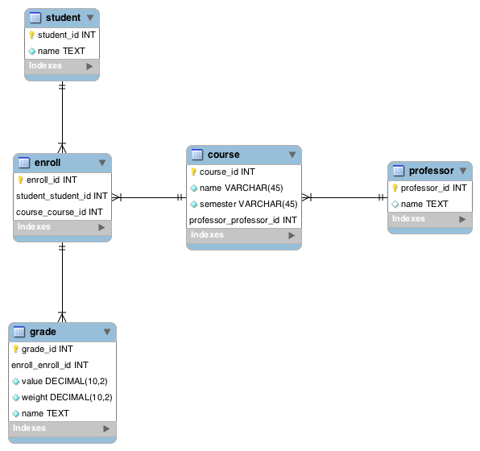

# NoSQL Workshop

The purpose of this workshop is to get a taste of two different NoSQL technologies: _Cassandra_ and _Neo4j_. 

We start by exploring a model in a traditional MySQL database and from there we build the data that will later be used in the NoSQL databases.

**Before starting**
 * Requisites: Docker.
 * All commands must by executed within the `nosql` folder of this repo.
 * Create a local image to work with the local examples by running: `docker build -t nosql-ws docker`.
 * Create an alias to simplify the execution of some commands ahead: `alias nosql-run="docker run --link nosql-mysql --link cassandra-2 --link nosql-neo4j --rm -v $(pwd):/app nosql-ws python`.

## Creating the MySQL database

Create the MySQL database as a Docker container, load the initial data and expose the 3306 port so that it can be access later:
```Shell
docker run --name nosql-mysql -e MYSQL_ALLOW_EMPTY_PASSWORD=1 -e MYSQL_DATABASE=torre -p 3306:3306  -v $(pwd)/docker/mysql_data:/docker-entrypoint-initdb.d -d mysql:5.7
docker logs -f nosql-mysql
```

Take a minute to understand the model and what it represents:



## Cassandra 
Cassandra is a column-family database that allows horizontal scaling. Let's start by creating 3 Cassandra nodes by executing:

```bash
docker run --name cassandra-1 -d cassandra:3.9
docker run --name cassandra-2 -d -e CASSANDRA_SEEDS="$(docker inspect --format='{{ .NetworkSettings.IPAddress }}' cassandra-1)" cassandra:3.9
docker run --name cassandra-3 -d -e CASSANDRA_SEEDS="$(docker inspect --format='{{ .NetworkSettings.IPAddress }}' cassandra-1)" cassandra:3.9
```


To check the cluster status run:
```bash
docker exec -ti cassandra-1 nodetool status
```
Once all nodes are in status `UN` we're good to go.

### Populating the database
Data modeling in Cassandra greatly depends on the nature of the queries you'll be doing. Because of that we need to focus on how the application on top of Cassandra will behave.

Suppose the application will allow a student to check his grades at the courses he/she is taking, and will allow professors to see the list of students of his/her course along with the current grade.

To be able to do that, we need two tables: one for each query. To create them first connect to the cluster:

```bash
docker run -it --link cassandra-2:cassandra --rm cassandra:3.9 cqlsh cassandra
```

and then run:
 
```
CREATE KEYSPACE torre WITH REPLICATION = { 'class': 'SimpleStrategy', 'replication_factor': 1 };
CREATE TABLE torre.student_grades (student_id int, course_id int, course_name text, professor_name text, grade float, PRIMARY KEY(student_id, course_id));
CREATE TABLE torre.professor_students (professor_id int, student_name text, grade float, PRIMARY KEY(professor_id, student_name));
```

Finally, to actually load data into the cluster run:
```bash
nosql-run cassandra/populate_database.py
```

### Performance
One of the key benefits of NoSQL databases is horizontal scaling and performance.

>**Important**: This is by no means a good performance assessment, but for our purposes it might be good enough.
 
Take as an example the students query mentioned before, it's going to be pretty common that students want to check out the current state of their courses. As such, we could take it as a performance measurement.
To do so, we're going to execute the query for each of the students in the database and record the time it takes for each database to run.

```bash
nosql-run cassandra/performance.py
```

These aren't the results we expected. 
>**TODO:** Why do you think it is?. Additionally, check out the file `cassandra/performance.py` and take a look at the complexity of the queries we're doing and think of how it'll behave with a large number of rows.

### CAP theorem
Another interesting thing we can do with Cassandra is test the CAP theorem. Because we usually can't guarantee that a cluster won't get a network partition, we choose to always have partition tolerance.
Now we can check how availabiltiy and consistency are traded off, first take down one node by running:

```bash
docker stop cassandra-1
```

And check the status of the cluster by running

```bash
docker exec -ti cassandra-2 nodetool status
```

One of the nodes should be `DN`. To test for availability we can run:

```bash
nosql-run cassandra/cap_availability.py
```

In this example, we're writing to the cluster and it's successful meaning that despite the fact that a node is down, we're still able to use the database.

Now we can test consistency by running:

```bash
nosql-run cassandra/cap_consistency.py
```

We can see that an error is thrown. This means that if we try to force consistency and have a partition, we'll loose the ability to write/read to the database.

## Neo4j
Neo4j is a Database that provides an efficient way to store/query data as graphs enabling applications to take advantage of this structure to execute otherwise complex queries.

Let's get a server up and running by executing:

```bash
docker run -p 7474:7474 -p 7687:7687 --name nosql-neo4j -d neo4j:3.0
```

Now go to http://localhost:7474, login with the default password and when asked, change it to `torre`. 

As we did before, let's populate the database with the same data from the example:
 
**Before continuing**
Update the alias to
```bash
alias nosql-run="docker run --link nosql-neo4j --link nosql-mysql --link cassandra-2 --link nosql-neo4j --rm -v $(pwd):/app nosql-ws python"
```

```bash
nosql-run neo4j/populate_database.py
```

Wait for it to finish and then run in the Neo4j console (at http://localhost:7474):
```
MATCH (p: Professor) WHERE p.professor_id = 1 RETURN p
```
Take a minute to understand the model by double-clicking on each node and see how they're related.

Suppose we want to find out the students of a professor, along with the grades:
```
MATCH (p: Professor)-[:TEACHES]->(c: Course)<-[t:TAKES]-(s: Student) WHERE p.professor_id = 1 RETURN s.student_id, s.name, t.grade
```
The result is something like a table that can be shown in a web page using any other web technologies.

A more complex query that hint us of the potential of having a graph database would be something like:

```
MATCH (s1: Student) WHERE s1.student_id = 1
MATCH (s2: Student) WHERE s2.student_id = 51
MATCH path = shortestPath((s1)-[:TAKES*..5]-(s2) )
RETURN s1, s2, path
```
The result shows how a student is connected with other by considering the courses they're enrolled in.


Considering that, let's take a look at how we could recommend courses to a student:
```
MATCH (s1: Student)-[t1:TAKES]->(c1: Course)<-[:TAKES]-(s2: Student)-[t2:TAKES]->(c2: Course)
WHERE s1.student_id = 1 AND t2.grade > 3
RETURN c2.name, avg(t2.grade) as avg_grade, count(*)
ORDER BY avg_grade DESC

```

>**TODO:** Write a query of your choice and explain it.


